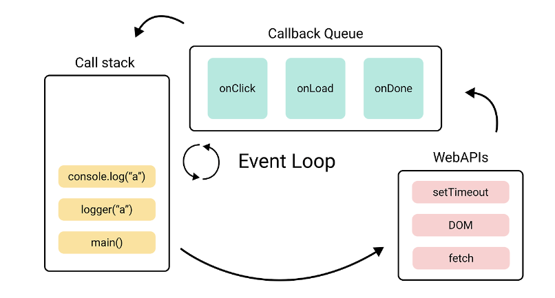

# 이벤트 루프

## 이벤트 루프란?

- 브라우저의 동작 타이밍을 제어하는 관리자
- 브라우저 내부의 Call Stack, Callback Queue, Web APIs 등의 요소들을 모니터링하면서 비동기적으로 실행되는 작업들을 관리하고,
  이를 순서대로 처리하여 프로그램의 실행 흐름을 제어해준다.

## 이벤트 루프의 동작 과정

- 자바스크립트의 `setTimeout` 같은 비동기 자바스크립트 코트를 Web APIs에게 맡긴다.
- Web APIs에서 작업이 끝난 결과를 콜백 함수 형태로 CallbackQueue에 넣는다.
- Call Stack이 비면 Callback Queue에서 Call Stack에 넣어 마무리 작업을 진행한다.

위의 방식을 원형 형태로 순회(loop)한다. 따라서 이벤트 루프라고 부르는 것이다.

이러한 이벤트 루프를 이용한 프로그램 방식을 이벤트 기반(Event Driven)프로그래밍이라고 한다.

## Callback Queue

Web API의 결과가 담기는 Callback Queue에는 Task Queue와 Microtask Queue가 있다.

### Task Queue

- `setTimeout`,` setInterval`,` fetch`,` addEventListener` 와 같이 비동기로 처리되는 함수들의 콜백 함수가 들어가는 큐 (macrotask queue 는 보통 task queue 라고 부른다)
- `promise.then`, `process.nextTick`, `MutationObserver` 와 같이 우선적으로 비동기로 처리되는 함수들의 콜백 함수가 들어가는 큐 (처리 우선순위가 높음)

Callback Queue의 종류에 따라 이벤트 루프가 콜 스택으로 옮기는 순서가 달라진다. 일반적으로 microtask queue가 가장 우선순위가 높아 먼저 microtask queue를 처리하여 먼저 비우고 그라음 task queue의 콜백을 처리한다.

---

출처: https://inpa.tistory.com/entry/🔄-자바스크립트-이벤트-루프-구조-동작-원리#web_apis의_종류 [Inpa Dev 👨‍💻:티스토리]
